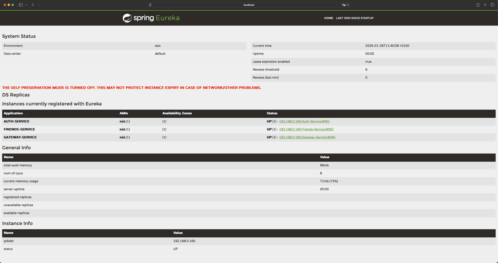

# Friends Service Documentation

## Introduction
Friends-Service is a microservice responsible for managing adding or removing friends and accepting or rejecting invitations. 
What's more it returns group of friends for each user and all registered users in the app. All relationships changes are write to
the database. Service has been written by using technologies:

* Java version 21.0.2
* Spring Boot version 3.3.6
* Spring Cloud version 2023.0.3
* Eureka client: Spring Cloud Netflix Eureka
* Spring Security: for authentication and authorization
* JWT (JSON Web Token): using io.jsonwebtoken for secure validation in the authentication process
* MySQL: using mysql-connector-java version 8.0.33
* Spring Data JPA: for database and ORM access
* Lombok to reduce boilerplate code in Java
* JUnit & Spring Security Test for testing with JUnit 5 and security testing tools
* Gradle: as a building tool and dependency manager

### Functionality:

   * users have ability to adding or removing friends from group of friends
   * accepting or rejecting invitations which has been sending by other friend
   * displays all registered user in the app
   * displays friends list for each user

## Setup and configuration

* [.env.example](.env.example)
* [application.properties](src/main/resources/application.properties)
* [gradle config file](build.gradle)

## How it works?
To run project ensure that all dependencies are installed end you have correctly configured Eureka-Service, Gateway-Service,
Auth-Service. Run first the Eureka-Service, Eureka-Gateway by entering command:

```shell
mvn spring-boot:run
```
And the next step run Auth-Service and Friends-Service by entering command:

```shell
./gradlew bootRun
```

Once the Eureka-Service, Eureka-Gateway, Auth-Service, Friends-Service is running, you can access the dashboard by navigating
to the following URL in your browser:

http://localhost:8761

The result should look like this:



### Entity class
This class represents the structure for storing essential friend information in the database,
such as userId, friendId, relationship status:

* [Entity class](src/main/java/Social_Talk/Friends_Service/Model/Friend.java)

### The FriendController class
Provides REST APIs for managing friendships, including adding friends, handling friend requests, and checking friendship status:

* [FriendController](src/main/java/Social_Talk/Friends_Service/Controller/FriendController.java)

### API Endpoints

| **HTTP Method**   | **Endpoint**                   | **Description**                                   |
|-------------------|--------------------------------|---------------------------------------------------|
| **POST**          | `/friends/add/{friendId}`      | Send a friend request to another user             |
| **POST**          | `/friends/accept/{friendId}`   | Accept a friend request from another user         |
| **POST**          | `/friends/reject/{friendId}`   | Reject a friend request from another user         |
| **GET**           | `/friends/{userId}`            | Retrieve the list of friends for a user           |
| **DELETE**        | `/friends/remove/{friendId}`   | Remove a friendship with another user             |
| **GET**           | `/friends/accepted`            | Get a list of accepted friends for a user         |
| **GET**           | `/friends/pending`             | Get pending friend requests received by the user  |
| **GET**           | `/friends/isFriend`            | Check if two users are friends                    |

### **Request Parameters**
| **Parameter**   | **Endpoint**                   | **Type**  | **Description**                                                      |
|-----------------|--------------------------------|-----------|----------------------------------------------------------------------|
| `userId`        | `/friends/add/{friendId}`      | `Long`    | The ID of the user sending the friend request                        |
| `friendId`      | `/friends/add/{friendId}`      | `Long`    | The ID of the user receiving the friend request                      |
| `userId`        | `/friends/accept/{friendId}`   | `Long`    | The ID of the user accepting the friend request                      |
| `friendId`      | `/friends/accept/{friendId}`   | `Long`    | The ID of the friend request being accepted                          |
| `userId`        | `/friends/reject/{friendId}`   | `Long`    | The ID of the user rejecting the friend request                      |
| `friendId`      | `/friends/reject/{friendId}`   | `Long`    | The ID of the friend request being rejected                          |
| `userId`        | `/friends/{userId}`            | `Long`    | The ID of the user whose friends list is being retrieved             |
| `userId`        | `/friends/remove/{friendId}`   | `Long`    | The ID of the user removing a friend                                 |
| `friendId`      | `/friends/remove/{friendId}`   | `Long`    | The ID of the friend being removed                                   |
| `userId`        | `/friends/accepted`            | `Long`    | The ID of the user whose accepted friends are being retrieved        |
| `userId`        | `/friends/pending`             | `Long`    | The ID of the user whose pending friend requests are being retrieved |
| `userId1`       | `/friends/isFriend`            | `int`     | The ID of the first user being checked for friendship                |
| `userId2`       | `/friends/isFriend`            | `int`     | The ID of the second user being checked for friendship               |

## Important annotations

For the Friends-Service to work properly, make sure that the following annotations have been added to the main
application class:

* **@SpringBootApplication:** this is mandatory for Spring Boot,
* **@EnableEurekaClient:** is used to enable Eureka Client functionality in a Spring Boot application